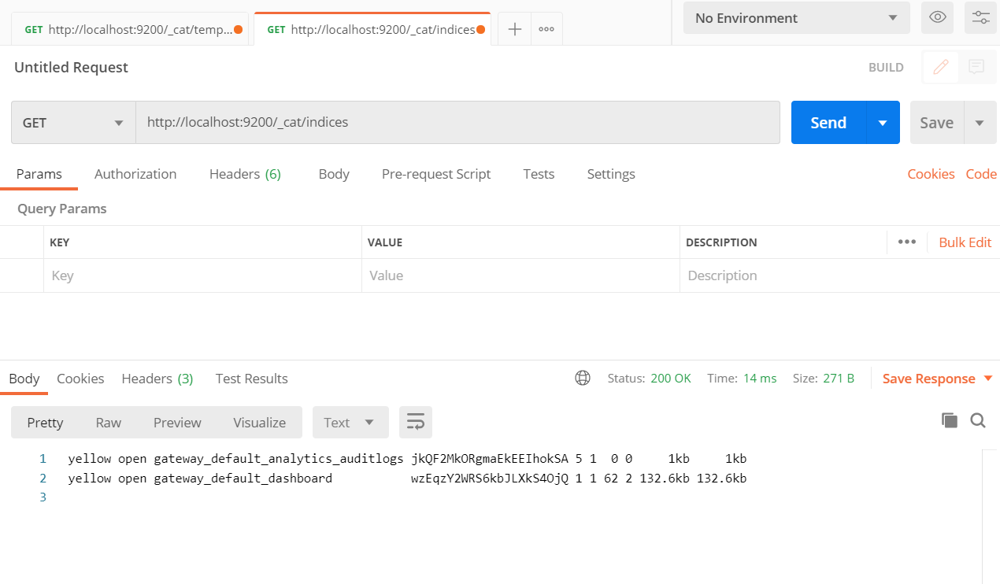
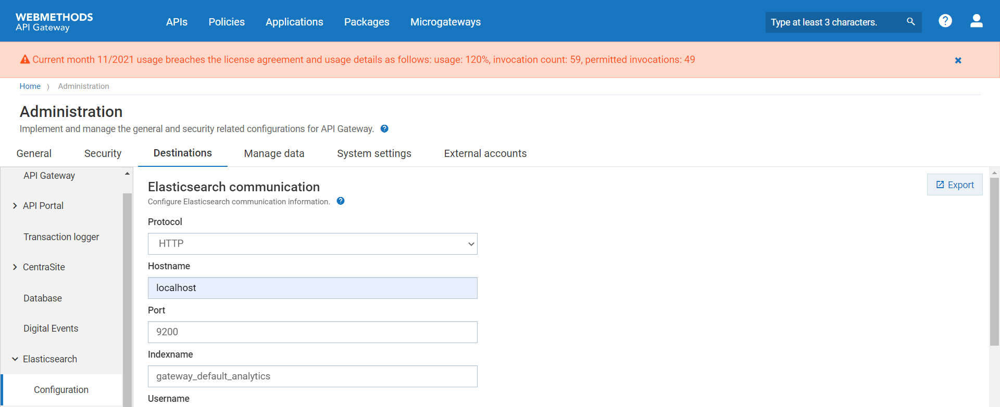
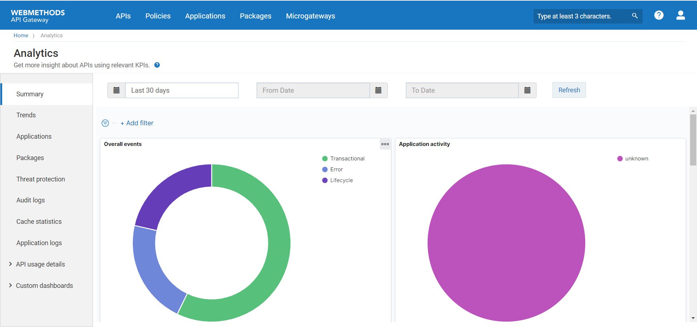

Overview
--------

This tutorial will guide you to connect the dashboards (Kibana,bundled with API Gateway) to external Elasticsearch where the transactional events or other analytics data are stored. In API Gateway, it is possible to use the "Destinations" feature to send transactional logs to an external Elasticsearch while you still use the Internal Data Store to store your core data (assets/configurations). 

Steps to be followed to connect Default Kibana(bundled with API Gateway) to External Elasticsearch for analytics while you still use the Internal Data Store to store your core data.
======================================================================================================================================================================================
1.  Set the property ***apigw.kibana.autostart*** to false in ***uiconfiguration.properties*** file located at ***<SAG_Root>\profiles\IS_default\apigateway\config\.***
2.  Open ***kibana.yml*** file located at ***<SAG_Root>/profiles/IS_default/apigateway/dashboard/config*** and specify the external Elasticsearch host and port details, which the Kibana has to connect to, as follows:
    ```
    elasticsearch.hosts: "http://<ExternalElasticsearchHost>:<ExternalElasticsearchPort>"
    ```
3.  Remote hosts have to be explicitly allowed in ***elasticsearch.yml*** file of External Elasticsearch using the reindex.remote.whitelist property.
   
    For Example if our InternalDatastore which is running in our local machine uses the port 9240, then reindex.remote.whitelist should point to localhost:9240.
    ```
    reindex.remote.whitelist : localhost:9240
    ``` 
    (Here reindex.remote.whitelist property can be set to list of comma delimited allowed remote host and port combinations.)
4.  Start External Elasticsearch.
5.  Start APIGateway and InternalDatastore.
6.  Import the postman collection "[External ES And Internal Kibana](attachments/External_Es_And_Internal_Kibana.json)".
7.  Edit internalESHost,internalESPort,externalESHost,externalESPort,tenant_name variables in "External ES And Internal Kibana" postmanCollection as per your need.
    
    Where internalESHost - Internal Elasticsearch(InternalDataStore) Host. <br />
          internalESPort - Internal Elasticsearch(InternalDataStore) Port. <br />
          externalESHost - External Elasticsearch Host. <br />
          externalESPort - External Elasticsearch Port. <br />
          tenant_name - Tenant name. <br />

    

8.  Run the PostmanCollection "***External ES And Internal Kibana***". It will reindex the dashboard index from internalDatastore to externalElasticsearch and create templates for " gateway_<_tenant-name_>\_analytics_* " &nbsp; indices in
    external Elasticsearch. 
    You can execute the below commands and cross verify the result after running the postman collection.
    
    -   **GET http://<_ExternalElasticsearchHost_>:<_ExternalElasticsearchPort_>/_cat/indices**
        
        
        
    -  **GET http://<_ExternalElasticsearchHost_>:<_ExternalElasticsearchPort_>/_cat/templates**
    
        
        
10. Start Kibana using the kibana.bat file located at ***<SAG_Root>/profiles/IS_default/apigateway/dashboard/bin***.
11. Configure your external Elasticsearch destination details in the Administration screen.Refer https://documentation.softwareag.com/webmethods/api_gateway/yai10-7/10-7_API_Gateway_webhelp/index.html#page/api-gateway-integrated-webhelp%2Fgtw_configure_es.html%23 and
https://documentation.softwareag.com/webmethods/api_gateway/yai10-7/10-7_API_Gateway_webhelp/index.html#page/api-gateway-integrated-webhelp%2Fgtw_configure_es_events.html%23 for details on how to configure external elasticsearch destination for APIGateway 10.7.
        
    - Uncheck all the checkboxes in API Gateway Destination and check all the checkboxes in Elasticsearch destination as shown in the below images.
    
      
    
      
    
    - Make sure the Indexname is "gateway_<_tenant-name_>_analytics"(For example, if your tenant-name is "default" then your Indexname should be "gateway_default_analytics") in Elasticsearch destination Configuration page.
    
      
    
11. Create APIs. Configure the policies. All the log invocation policies should have Elasticsearch as its destination. API Gateway destination must be turned off.

      
    
12. Invoke APIs via Elasticsearch REST calls and make sure the events are getting populated in the external Elasticsearch destination
13. Now, invocations should be visible in API Gateway analytics page.

      
    
Limitations
===========
1. Threat Protection, Cache Statistics, API usage details dashboards and Custom dashboards will not work with this setup.

2. API Gateway analytics can render data from only ONE source. It cannot pull from multiple sources like Internal Data Store and external Elasticsearch.
