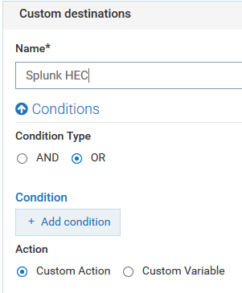
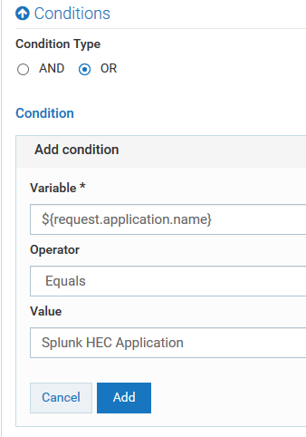
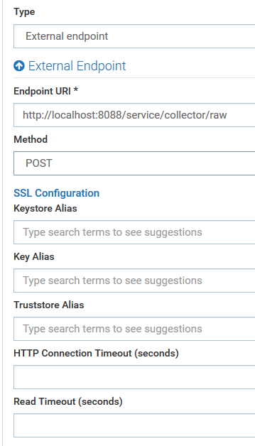
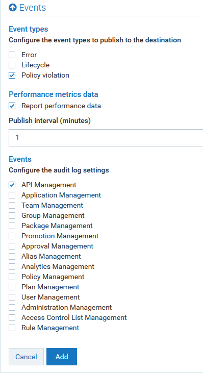
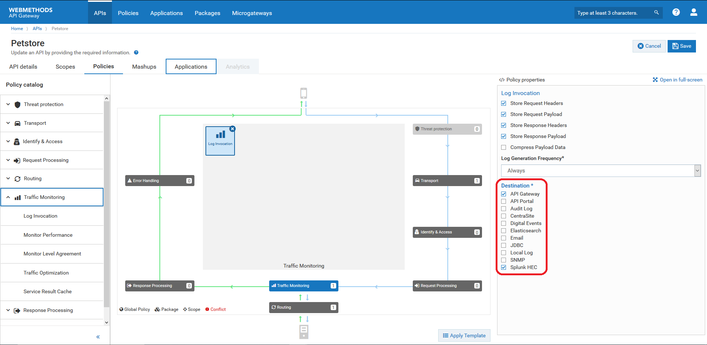
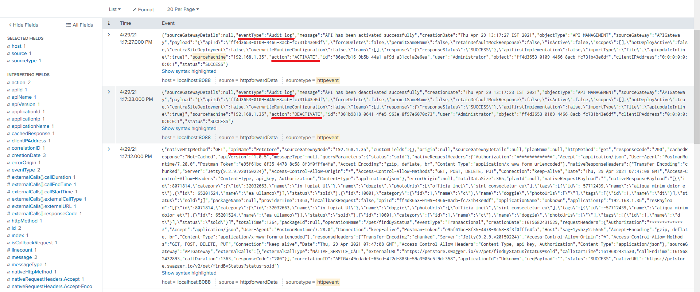
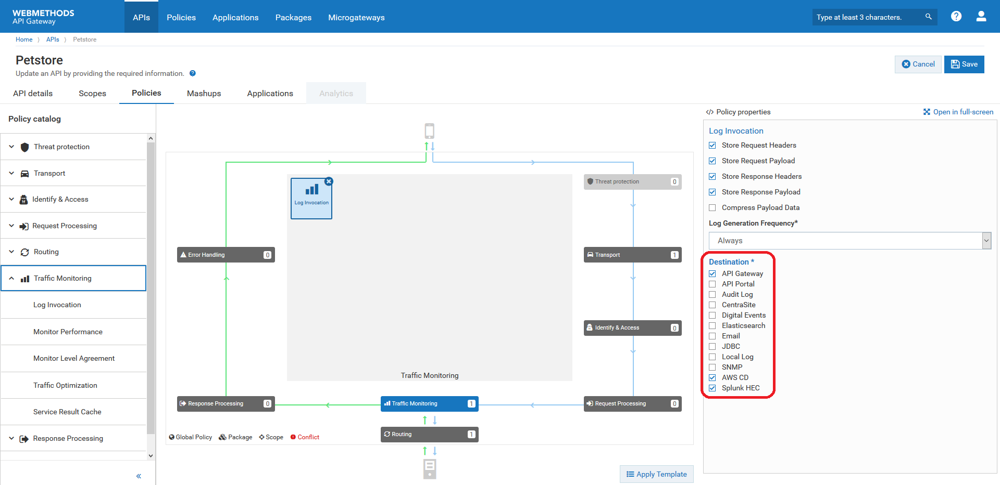
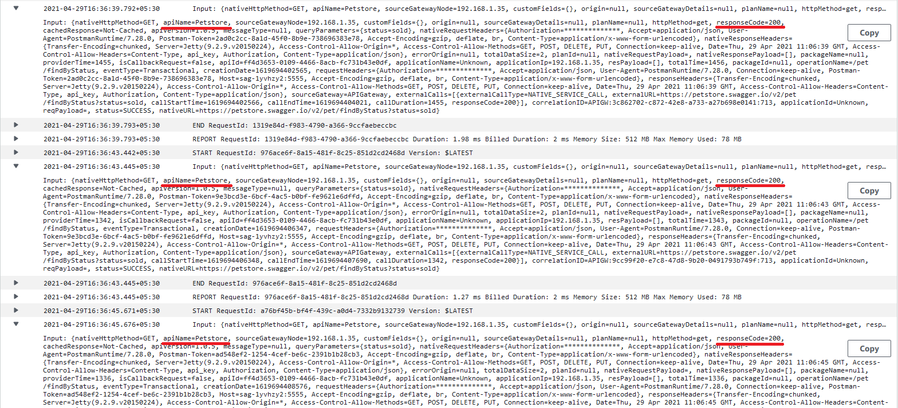

# Custom Destinations in API Gateway

###### Supported Versions: 10.7 and above

# Overview of the tutorial

API Gateway supports different destinations, out of the box, to which one can  publish events, performance metrics and audit log data. Event type data  provides information about API transactions. The performance data  provides information on average response time, total request count,  fault count, and so on, for the APIs that it hosts. Audit logs provide a record of system transactions, events, and occurrences in API Gateway. You must have the API Gateway's manage destination configurations functional privilege assigned to  configure the following destinations to which the event types,  performance metrics, and audit log data is published.

API Gateway currently supports the below destinations:

- API Gateway
- API Portal
- Transaction logger
- CentraSite
- Database
- Digital Events
- Elasticsearch
- Email
- SNMP

In addition to the existing destinations, API Gateway now supports Custom Destinations using which the user can publish events, performance metrics and audit  log data from API Gateway to destinations which are not supported out of the box. 

The tutorial shows how you can use Custom Destinations feature to push the data from API Gateway to Splunk and  AWS Lambda function

# Required knowledge

The tutorial assumes that the reader has,

- a basic understanding of API Gateway and its event types
- a good knowledge on Splunk and AWS Lambda
- read the custom destinations feature details from the API Gateway User Guide

# Why Custom Destinations?

API Gateway provides options to publish events and logs to preset  destinations. But sometimes customer might require the data to be  published to a different destination for further data processing and for generating various reports as per their business requirements. The  custom destination feature offers solution to this requirement.
You can configure custom destinations to publish either or all of the following:

- Design time events such as audit logs of API Gateway modules
- Error events and policy violation events of assets, and Performance metrics data.
- Traffic monitoring payloads and alerts of an API

# Prerequisite steps

- Install API Gateway version 10.7 or above if the reader uses on-premise  installation (Note: Custom Destination is supported in cloud as well).

# Details

API Gateway supports 4 custom destinations as of 10.7.

1. External HTTP/HTTPs endpoint
2. webMethods IS service
3. AWS Lambda
4. Messaging

Custom Destination can be added for the following monitoring types under Traffic Monitoring.

- Log Invocation
- Monitor Performance
- Monitor Level Agreement
- Traffic Optimization

In this section let us discuss in details about how we can configure API  Gateway to send data to an External endpoint(Splunk) and AWS Lambda.

## External endpoint

This use case explains how to publish data to a REST endpoint(Splunk) using  custom destination. The use case starts when you have data to be  published and ends when you have successfully configured a REST endpoint URL as a destination to publish the data. Ensure you have the external  endpoint URL to which you want to publish the data.

### Step 1: Configure Splunk to receive events

Follow [this link](https://docs.splunk.com/Documentation/Splunk/8.1.3/Data/UsetheHTTPEventCollector) to setup the HTTP Event Collector in Splunk. Once you're ready with the Token and Endpoint do a curl request to check whether the configuration is working properly using the below curl command.

```c
Request: curl -k http://<<host>>:<<port>>/services/collector/event -H "Authorization: Splunk <<Token>>" -d '{"event": {"name": "Developer"}}'
Response: {"text": "Success", "code": 0}

Request: curl -k http://<<host>>:<<port>>/services/collector/raw -H "Authorization: Splunk <<Token>>" -d '{"name": "Developer"}'
Response: {"text": "Success", "code": 0}
```

Or the same can be validated using postman with the below details.

```java
URL: http://<<host>>:<<port>>/services/collector/event
Authorization: Basic authorization with Username: Splunk and Password: <<Token>>
Method: POST
Payload: {"event":"hello world"}
```

Default Splunk URL: ***POST http://localhost:8088/services/collector/raw***

### Step 2: Create Custom Destination

Login to API Gateway, expand the menu options icon available in the top right in the title bar, and select Administration. Click Destinations and  select Custom destinations from the left navigation pane. Click + Add  custom destination.

#### Name:

Provide a Unique Name for the Custom destination. Supported characters are [a-zA-Z0-9-_ ].



### Condition based publishing

You can configure conditions based on which API Gateway filters events to  publish to a configured destination. That is, only the events that  satisfy your conditions are published to the given destination. For  example, you can configure a condition to publish the error events of an application, say app1, to a destination; and another condition to publish the error events of another application, app2, to a second destination and so on.


To configure a condition, you can use variables available in the  variable framework, and specify a matching value based on which the  condition must be validated. You can specify multiple conditions and  configure whether the data to be published must satisfy all or any of  the given conditions. The use cases in this section explain the process  of configuring conditions.

#### Conditions:

Conditions are completely optional. One can configure multiple conditions and  everything will be validated based on the Condition type. In this case,  if the application name matches with **'Splunk HEC Application',** only then API Gateway will send the configured events to Splunk.



After configuring the condition variable and value click Add.

#### Type - External endpoint:

Select the Custom destination type as External endpoint and provide the necessary details like URL, Method, SSL, and Timeout.



#### Request Processing:

Under request processing click Headers and Add Authorization header.

Header Name: Authorization

Header Value: Encode ***"****Splunk <<SplunkToken>>"*** and configure it as Basic <<encoded value>>, then Click Add.


#### Events:

Select the data that you want to publish to the configured destination.



After all the successful configuration click Add to add Custom destination.

### Step 3: Create the API and add Custom Destination

Login to API Gateway and create a *Petstore* API from the swagger definition URL http://petstore.swagger.io/v2/swagger.json alternatively you can use the existing API which is already available in API Gateway. Edit the API, go to *Policies → Traffic Monitoring →* Add *Log Invocation → Select Splunk HEC under Destination*.



After all the configuration click Save and Activate the API.

### Step 4: Custom Destination in action

Invoke the API using a REST client like Postman to generate Transactional  Event. Deactivate and Activate the API to generate Audit Log data.

Open Splunk and search for **sourcetype="httpevent",** the splunk search will look like this,



From the search response you can see the Audit log for Activate and Deactivate, and Transactional events published to Splunk.

## Type 2: AWS Lambda

AWS Lambda is a compute service used to run code without provisioning or  managing server. You can write your application code in languages  supported by AWS Lambda, and run within the AWS Lambda standard runtime  environment and resources provided by Lambda. As mentioned earlier,  customer can have their custom logic running in AWS for further data  processing and for generating various reports as per their business  requirements. API Gateway provides support to publish events to the  Lambda functions through Custom Destination.

### Step 1: Create AWS Lambda Function

Follow [this link](https://docs.aws.amazon.com/toolkit-for-eclipse/v1/user-guide/lambda-tutorial.html) to create a AWS Lambda Function. For this tutorial I have created a  simple logging function in AWS Lambda with Function Name  APIGatewayEvents.

**AWS Lambda Function**

```java
public class APIGatewayEvents implements RequestHandler<Object, String> {
    @Override
    public String handleRequest(Object input, Context context) {
        context.getLogger().log("Input: " + input);
        return "Received data";
    }
}
```

### Step 2: AWS Lambda alias

To invoke a Lambda function, we need to create a AWS account configuration in the API Gateway Administration section with the Access key ID,  Secret access key and Region. This can be created by navigating to  Administration → External accounts → AWS configuration. Configure the  AWS account details here and use it as an alias in the Custom  Destination. API Gateway supports configuration of multiple AWS  accounts.


Click Add to add the AWS account in API Gateway.

### Step 3: Create Custom Destination 

Name, Conditions, Request Processing, and Events sections remains same for AWS Lambda also.

#### Type - AWS Lambda:

Select the Custom destination type as AWS and provide the necessary details  like Function Name, Invocation Type, AWS Alias, and Client  Configuration.


##### Function Name

This is the AWS Lambda function name that you want to invoke during the API execution flow.

##### Invocation Type

Two types of invocation are supported - RequestResponse and Event. RequestResponse is synchronous and Event is asynchronous.

##### AWS Alias

AWS configuration for connecting to the AWS account which hosts the Lambda function.

##### Client Configuration

These are the configurations for the AWS Lambda client in API Gateway which  are useful when making a connection to the AWS Lambda function. Select  the client configuration from drop down or provide custom client  configuration as AWS introduces.

For AWS Client Configuration please refer[ https://docs.aws.amazon.com/sdk-for-java/v1/developer-guide/section-client-configuration.html](https://docs.aws.amazon.com/sdk-for-java/v1/developer-guide/section-client-configuration.html) and[ https://docs.aws.amazon.com/AWSJavaSDK/latest/javadoc/index.html?com/amazonaws/ClientConfiguration.html.](https://docs.aws.amazon.com/AWSJavaSDK/latest/javadoc/index.html?com/amazonaws/ClientConfiguration.html)

### Step 3: Create the API and add Custom Destination

Login to API Gateway and create a *Petstore* API from the swagger definition URL http://petstore.swagger.io/v2/swagger.json alternatively you can use the existing API which is already available in API Gateway. Edit the API, go to *Policies → Traffic Monitoring →* Add *Log Invocation → Select AWS CD under Destination*.



After all the configuration click Save and Activate the API.

### Step 4: Custom Destination in action

Invoke the API using a REST client like Postman to generate Transactional  Event. Deactivate and Activate the API to generate Audit Log data.

Open AWS Lambda to check the events. Login to AWS console, then Services →  Lambda → Functions → Choose the Lambda Function(APIGatewayEvents).

In the function overview tab Click Monitor → View logs in CloudWatch.


This will open a new Cloud Watch tab. In the Log streams select any one  of the stream. It will list all the log statement along with the data  published from API Gateway.




# References

- https://docs.aws.amazon.com/toolkit-for-eclipse/v1/user-guide/lambda-tutorial.html
- https://docs.aws.amazon.com/lambda/latest/dg/welcome.html
- https://docs.aws.amazon.com/sdk-for-java/v1/developer-guide/section-client-configuration.html
- https://docs.aws.amazon.com/AWSJavaSDK/latest/javadoc/index.html?com/amazonaws/ClientConfiguration.html
- https://docs.aws.amazon.com/lambda/latest/dg/welcome.html
- https://docs.splunk.com/Documentation/Splunk/8.1.3/Data/UsetheHTTPEventCollector

# Learn more

- For details on usage of *Invoke webMethods IS* policy in versions 10.2 and above, refer [Invoke webMethods IS policy in API Gateway 10.2](https://iwiki.eur.ad.sag/display/RNDWMGDM/Invoke+webMethods+IS+policy+in+API+Gateway+10.2)
- For details on AMQP [AMQP 1.0 support in API Gateway](https://iwiki.eur.ad.sag/display/RNDWMGDM/AMQP+1.0+support+in+API+Gateway)
